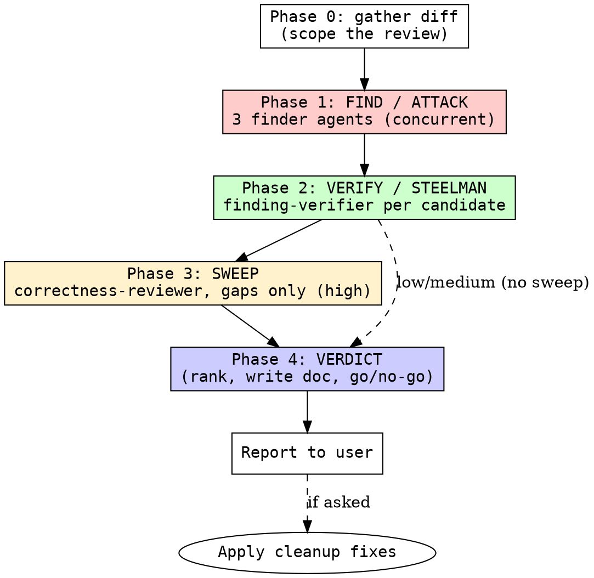

# reviewing-code

## Overview

Best-in-class diff review, powered by **4 custom subagents** that each get their own context window and a scoped read-only toolset: fan out the finders to surface candidates, adversarially verify each one (steelman that it is real, or refute it from the code), sweep for gaps, then deliver a ranked verdict. **Correctness always outranks cleanup.** Two finding classes:

- **Correctness** — runtime bugs the diff introduces or fails to fix.
- **Cleanup** — reuse, simplification, efficiency, altitude. Quality, not bugs.

## Agents

Dispatch these by `subagent_type`. Definitions live in [`agents/`](agents/) (install them so your agent registers them — see the repo README).

| Agent | Role | Angles |
|-------|------|--------|
| [`correctness-reviewer`](agents/correctness-reviewer.md) | finder | line-by-line, removed-behavior, language pitfalls (A/B/D) |
| [`integration-reviewer`](agents/integration-reviewer.md) | finder | cross-file call sites, wrapper/proxy routing (C/E) |
| [`cleanup-reviewer`](agents/cleanup-reviewer.md) | finder | reuse, simplification, efficiency, altitude (the `/simplify` pass) |
| [`finding-verifier`](agents/finding-verifier.md) | verifier | 3-state CONFIRMED / PLAUSIBLE / REFUTED |

If a host can't register named agents, fall back to dispatching generic subagents with each agent file's body as the prompt.

<HARD-GATE>
NEVER ship a finding as CONFIRMED without verifying it against the actual code. NEVER deliver a verdict without completing Find → Verify → Sweep. Correctness findings ALWAYS rank above cleanup. Do NOT refute a candidate for being "speculative" when the triggering state is realistic (concurrency, rare-but-reachable nil, falsy-zero, boundary off-by-one, retry/partial-failure) — that is PLAUSIBLE, not REFUTED.
</HARD-GATE>

## Effort dial

Scale which agents run to the request (default **medium**):

| Effort | Finder agents | Candidates/agent | Verify | Sweep | Cap |
|--------|---------------|------------------|--------|-------|-----|
| low    | `correctness-reviewer` only | 4 | no | no | ≤4 |
| medium | `correctness-reviewer`, `integration-reviewer`, `cleanup-reviewer` | 6 | `finding-verifier`, 1-vote | no | ≤10 |
| high   | `correctness-reviewer`, `integration-reviewer`, `cleanup-reviewer` | 8 | `finding-verifier`, 1-vote | yes | ≤15 |

Correctness-only (drop `cleanup-reviewer`) or cleanup-only (run `cleanup-reviewer` alone) on request. Cleanup is optional; correctness is never skipped above `low`.

## Checklist

1. **Phase 0 — Gather the diff** — run `git diff @{upstream}...HEAD` (fallback `git diff main...HEAD` / `git diff HEAD~1`); also `git diff HEAD` for uncommitted work, since review often runs pre-commit. If a PR number / branch / path was passed, review that instead. Skip test/fixture hunks. This diff is the review scope.
2. **Phase 1 — Find (ATTACK)** — dispatch the finder agents for the chosen effort (`correctness-reviewer`, `integration-reviewer`, `cleanup-reviewer`) via the Agent tool **in a single message** so they run concurrently. Pass each the diff and its candidate cap N. Each returns up to N candidates in `{file, line, summary, failure_scenario}` shape. Do NOT let one agent suppress another.
3. **Phase 2 — Verify (STEELMAN)** — dedup candidates pointing at the same line/mechanism. Dispatch `finding-verifier` once per remaining candidate (concurrently): it returns **CONFIRMED / PLAUSIBLE / REFUTED** (PLAUSIBLE by default). Keep CONFIRMED + PLAUSIBLE; drop REFUTED.
4. **Phase 3 — Sweep** (high effort) — dispatch one fresh `correctness-reviewer` given the verified list, hunting ONLY for gaps the first pass missed. No padding; empty sweep is fine.
5. **Phase 4 — Verdict** — rank correctness above cleanup, most-severe first, to the cap. Write the review to `docs/raki/reviews/<date>-<topic>-code-review.md` (resolve `<date>` with `date +%F`). Deliver **GO / GO-WITH-FIXES / NO-GO**.
6. **Report** — summarize the verdict and top findings to the user. Do not bury a NO-GO in prose.
7. **(Optional) Apply cleanup fixes** — only if asked. Fix cleanup findings directly; skip any whose fix would change behavior, reach well outside the diff, or that you judge a false positive — note the skip rather than arguing with it. Never auto-apply correctness fixes; surface those for the author.

## Process Flow

## Key Principles

- **Correctness outranks cleanup.** When the cap forces a cut, bugs survive, cleanups go.
- **Verify before you assert.** A finder's candidate is a hypothesis; only a verifier's vote makes it a finding.
- **PLAUSIBLE by default.** Refute only when constructible from the code: factually wrong (quote the line), provably impossible (cite the type/invariant), already guarded in this diff (cite the guard), or pure style with no observable effect.
- **Name the failure, not the vibe.** Every correctness finding states concrete inputs/state → wrong output/crash. Every cleanup finding states the concrete cost (what is duplicated, wasted, harder to maintain).
- **Read the enclosing function, not just the hunk.** Bugs in unchanged lines of a touched function are in scope.
- **Bugs in deletions count.** For every removed line, name the invariant it enforced and find where it is re-established.
- **Altitude over bandaids.** Special cases layered on shared infrastructure signal the fix isn't deep enough — prefer generalizing the mechanism.

## Red Flags

| Flag | Meaning |
|------|---------|
| Findings shipped without verification | Unverified candidates are noise; run Phase 2 |
| Cleanup ranked above a correctness bug | Violates the ordering gate |
| "Speculative" used to refute a realistic state | That's PLAUSIBLE; the gate forbids this refutation |
| Reviewing only changed lines | Misses bugs in the enclosing function and at call sites |
| Vague finding ("could be cleaner") | No named failure/cost; not actionable |
| Auto-applying correctness fixes | Author must see and own correctness changes |
| Padding the sweep | Phase 3 is gaps-only; invented findings erode trust |
| No diff scope established | Phase 0 skipped; review is unanchored |

## Safety

- **Tool posture:** read-only over the diff and codebase; the ONLY writes are the review file under `docs/raki/reviews/` and — *only when explicitly asked* — the optional cleanup-fix application step. Finder/verifier agents declare `tools: Read, Grep, Glob` and cannot edit.
- **Must never:** auto-apply correctness fixes (the author must own those); apply a cleanup fix that changes behavior or reaches well outside the diff; ship a finding as CONFIRMED without verifying it; modify `CLAUDE.md`, `AGENTS.md`, or memory files of other tools.
- **Must always:** establish the diff scope in Phase 0; verify before asserting; rank correctness above cleanup; note any skipped cleanup rather than silently dropping it.

## Memory

Each run reads [`.memory.md`](.memory.md) in Phase 0 (known false positives, project conventions like a custom auth pattern that is *not* a vulnerability, recurring bug classes) and appends durable lessons after the verdict. This stops the skill from re-flagging the same intentional patterns every review.

## Integration

- **Third review skill** alongside `reviewing-specs` (validates the spec) and `reviewing-plans` (validates the plan). This one validates the *code*.
- **Used AFTER** implementation / `executing-plans`, **BEFORE** merge or opening a PR.
- **Folds in `/simplify`:** the `cleanup-reviewer` agent runs the same angles (Reuse, Simplification, Efficiency, Altitude); run cleanup-only + the optional apply step for a pure simplify pass.
- **Output destination:** `docs/raki/reviews/<date>-<topic>-code-review.md`. A NO-GO sends the work back to implementation; GO-WITH-FIXES lists ranked required fixes. The 4 finder/verifier agent definitions live in [`agents/`](agents/).
