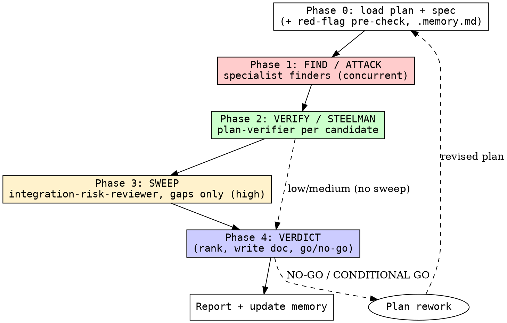

# reviewing-plans

## Overview

Multi-angle execution-readiness review, powered by **specialist subagents** that each get their own context window and a scoped read-only toolset: fan out the finders to attack the plan from every dimension, adversarially verify each candidate, sweep for gaps, then deliver a ranked verdict. **Plans fail in execution, not in theory** — this gate catches ordering, sizing, testing, and rollback risks before they reach `executing-plans`.

Findings span five dimensions: **dependency/ordering, task sizing, test plan, rollback/migration, integration risk**.

## Agents

Dispatch these by `subagent_type`. Definitions live in [`agents/`](agents/) (install them so your agent registers them — see the repo README).

| Agent | Role | Dimension |
|-------|------|-----------|
| [`dependency-order-reviewer`](agents/dependency-order-reviewer.md) | finder | circular deps, missing prereqs, unsafe order, missed parallelism |
| [`task-sizing-reviewer`](agents/task-sizing-reviewer.md) | finder | oversized/vague tasks, inconsistent granularity, missing acceptance |
| [`test-plan-reviewer`](agents/test-plan-reviewer.md) | finder | missing tests, verification steps, regression/data-integrity gaps |
| [`rollback-migration-reviewer`](agents/rollback-migration-reviewer.md) | finder | rollback strategy, irreversible migrations, backups, rollback criteria |
| [`integration-risk-reviewer`](agents/integration-risk-reviewer.md) | finder | interface changes, blast radius, coordination, version skew (high) |
| [`plan-verifier`](agents/plan-verifier.md) | verifier | 3-state CONFIRMED / PLAUSIBLE / REFUTED |

If a host can't register named agents, fall back to dispatching generic subagents with each agent file's body as the prompt.

<HARD-GATE>
NEVER approve a plan without completing Find → Verify → Verdict for the chosen effort. NEVER ship a HARD-GATE finding with a GO verdict — an unresolved blocker forces CONDITIONAL GO or NO-GO. NEVER execute any plan task or modify source — write only the review to `docs/raki/reviews/`. Every finding must cite the specific task/section and carry a concrete fix. A task estimated > 30 minutes with no subtasks is always a HARD-GATE.
</HARD-GATE>

## Effort dial

Scale which agents run to the plan's blast radius (default **medium**):

| Effort | Finder agents | Candidates/agent | Verify | Sweep | Cap | Use when |
|--------|---------------|------------------|--------|-------|-----|----------|
| low    | `dependency-order-reviewer`, `task-sizing-reviewer` | 4 | no | no | ≤4 | Single-system plan, familiar domain, no data changes |
| medium | + `test-plan-reviewer`, `rollback-migration-reviewer` | 4 | `plan-verifier`, 1-vote | no | ≤12 | Multi-task plan, production release (default) |
| high   | + `integration-risk-reviewer` | 4 | `plan-verifier`, 1-vote | yes | ≤18 | Migrations, breaking API changes, infra, >3 systems |

Default to `medium` for production plans. Escalate to `high` automatically for database migrations, API breaking changes, infrastructure changes, user-facing releases, or plans spanning more than three systems.

## Checklist

1. **Phase 0 — Load plan + spec** — read the plan AND the spec it implements. If no spec exists, STOP and review the spec first (`reviewing-specs`). Read `.memory.md` for accumulated lessons. Pre-check the Red Flags table; any HARD-GATE flag escalates effort to at least `medium` and is recorded as a pre-existing finding.
2. **Phase 1 — Find (ATTACK)** — dispatch the finder agents for the chosen effort via the Agent tool **in a single message** so they run concurrently. Pass each the plan, the spec, and its candidate cap N. Each returns up to N candidates in `{task_ref, category, issue, evidence, fix, severity}` shape. Do NOT let one agent suppress another.
3. **Phase 2 — Verify (STEELMAN)** — dedup candidates pointing at the same task/concern. Dispatch `plan-verifier` once per remaining candidate (concurrently): it returns **CONFIRMED / PLAUSIBLE / REFUTED**. Keep CONFIRMED + PLAUSIBLE; drop REFUTED. All HARD-GATE findings MUST be verified.
4. **Phase 3 — Sweep** (high effort) — dispatch one fresh `integration-risk-reviewer` given the verified list, hunting ONLY for cross-cutting gaps the focused passes missed (a missing task, an untested path, a single point of failure). Verify any new findings. Empty sweep is fine.
5. **Phase 4 — Verdict** — rank by severity (HARD-GATE → WARNING → NOTE) to the cap. Resolve `<date>` with `date +%F` and write the review to `docs/raki/reviews/<date>-<topic>-plan-review.md`. Deliver **GO / CONDITIONAL GO / NO-GO**.
6. **Report** — summarize the verdict and top findings to the user. Do not bury a NO-GO in prose. Append any durable lesson to `.memory.md`.

## Process Flow



## Key Principles

- **Plans fail in execution, not theory.** A beautiful plan that cannot be implemented step-by-step is worthless. We judge execution readiness, not prose.
- **Attack first, steelman second.** Every finder tries to break the plan; the verifier then steel-mans each finding to kill false positives.
- **Every task needs a verification step.** If you cannot define "done," the task is not ready.
- **Sizing is a first-class concern.** Tasks estimated > 30 minutes must decompose further — always a HARD-GATE.
- **No hand-waving.** "Handle errors gracefully" is not a plan; specific handling per failure mode is.
- **HARD-GATE blocks GO.** Any unresolved HARD-GATE forces CONDITIONAL GO or NO-GO, regardless of how good the rest looks.
- **Traceability is mandatory.** Every finding links to a specific task, line, or section.

## Red Flags

Pre-check the plan for these on load. Any HARD-GATE present escalates effort and is recorded immediately:

| Red Flag | Severity | Owning finder |
|----------|----------|---------------|
| No rollback section | HARD-GATE | `rollback-migration-reviewer` |
| No test/verification section | HARD-GATE | `test-plan-reviewer` |
| Single "implement feature" task with no subtasks | HARD-GATE | `task-sizing-reviewer` |
| DB migration without a backup step | HARD-GATE | `rollback-migration-reviewer` |
| Circular / unsafe task ordering | HARD-GATE | `dependency-order-reviewer` |
| Task estimates missing or all identical | WARNING | `task-sizing-reviewer` |
| API change without consumer-update task | WARNING | `integration-risk-reviewer` |
| Tasks listed flat with no dependency ordering | WARNING | `dependency-order-reviewer` |
| Post-deploy monitoring omitted | WARNING | `test-plan-reviewer` |
| External dependency without owner/contact | WARNING | `dependency-order-reviewer` |

## Safety

Read-only over the plan, spec, and codebase; the only write is the review under `docs/raki/reviews/`. Finder/verifier agents declare `tools: Read, Grep, Glob` and cannot edit or execute. Never execute a plan task or modify source, and never touch `CLAUDE.md`, `AGENTS.md`, or other tools' memory files. Fail closed: when unsure, flag — the verifier downgrades.

## Memory

[`.memory.md`](.memory.md) holds project-specific lessons (known false positives, conventions, recurring plan gaps) — read it in Phase 0, append durable lessons in Phase 6, so the skill stops re-learning the same quirks.

## Integration

```
writing-plans (produces plan) -> reviewing-plans (validates execution readiness) -> executing-plans / subagent-driven-development
                                          |
                                          NO-GO / CONDITIONAL GO -> back to writing-plans for revision
```

- **Second review skill**, between `reviewing-specs` (validates the spec) and `reviewing-code` (validates the result). Review the spec BEFORE its plan.
- **Used AFTER** `writing-plans`, **BEFORE** `executing-plans` or `subagent-driven-development`.
- **Output destination:** `docs/raki/reviews/<date>-<topic>-plan-review.md`. A **NO-GO** sends the plan back to `writing-plans`; **CONDITIONAL GO** lists ranked required fixes. The specialist agent definitions live in [`agents/`](agents/).
