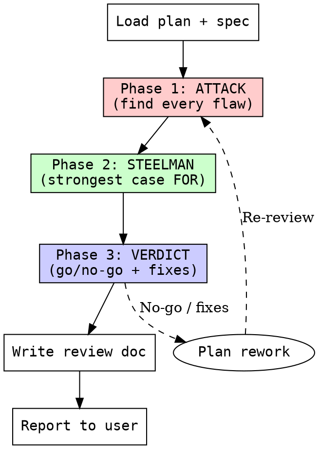

# Reviewing Plans

## Overview
Steel-man plan review methodology: destroy the plan to find execution risks, steelman it to find hidden strengths, then deliver a structured go/no-go verdict. Prevents plan failures before they reach execution.

<HARD-GATE>
NEVER approve a plan without completing all three phases (Attack, Steelman, Verdict) in sequence. Skipping a phase produces false confidence. A review without a written verdict is not a review.
</HARD-GATE>

## Checklist
1. **Load inputs** - Read the plan document and reference spec. Identify the domain, constraints, and success criteria.
2. **Phase 1: ATTACK** - Find hidden dependencies, task sizing issues, missing error handling, test coverage gaps, ordering problems, rollback risks. Be brutal. Assume the plan will fail.
3. **Phase 2: STEELMAN** - Build the strongest possible case FOR the plan. What does it get right? What structural advantages exist? What risks are already mitigated? Must be genuine, not perfunctory.
4. **Phase 3: VERDICT** - Deliver actual opinion: Go / Go with fixes / No-go. Include prioritized actionable fixes. Be specific about what would change the verdict.
5. **Write review** - Persist findings to `docs/raki/reviews/YYYY-MM-DD-<topic>-plan-review.md` with all three phases, verdict, and fix list.
6. **Report findings** - Summarize verdict and critical fixes to user. Do not bury a No-go in prose.

## Process Flow

## Key Principles
- **Plans fail in execution, not theory.** A beautiful plan that cannot be implemented step-by-step is worthless.
- **Every task must have a verification step.** If you cannot define "done," the task is not ready.
- **No hand-waving.** "Handle errors gracefully" is not a plan. Specific handling per expected failure mode is.
- **Steelman must be genuine.** A weak steelman corrupts the verdict. If you cannot argue for the plan, say so explicitly.
- **Sizing is a first-class concern.** Tasks estimated >30 minutes must decompose further.
- **The reviewer is adversarial by design.** Being kind to the plan is being cruel to execution.

## Red Flags
| Flag | Meaning |
|------|---------|
| Tasks without verification steps | No clear "done" criterion; will ship incomplete |
| No rollback plan | One-way changes with no recovery path |
| Missing error handling | Happy-path only; production will break |
| Tasks too large (>30 min) | Will stall mid-execution, lose context |
| Circular dependencies | Step A needs B, B needs A; plan cannot execute |
| No DRY analysis | Repeated work across tasks; signals poor decomposition |
| No spec reference | Plan invents requirements instead of following them |
| Vague action verbs | "Implement," "handle," "support" without specifics |
| Missing prerequisite checks | Assumes environment, permissions, or state that may not exist |
| No output artifacts defined | Tasks produce no observable result; cannot verify completion |

## Integration
- **Used AFTER:** `writing-plans` produces a plan.
- **Used BEFORE:** `executing-plans` or `subagent-driven-development` begins.
- **Output destination:** Review goes back to the planning session; plan is revised or approved.
- **Cross-session:** If resuming work, always review the plan from the prior session before proceeding. Plans stale out.

## Prompt Template
See [`plan-reviewer-prompt.md`](./plan-reviewer-prompt.md) for the subagent prompt.
