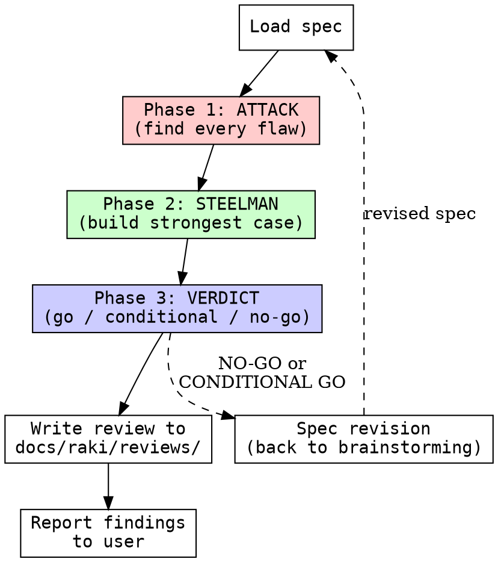

# reviewing-specs

## Overview

Steel-man spec review: destroy the spec to find every weakness, then build the strongest possible case for it, then deliver a structured verdict with actionable fixes.

<HARD-GATE>
NEVER approve a spec without completing all three phases: Attack, Steelman, Verdict. No partial reviews. No skipping phases because the spec "looks fine."
</HARD-GATE>

## Checklist

1. **Load spec** - Read the spec document in full. Note its stated goals, constraints, scope, and success criteria.
2. **Phase 1: ATTACK** - Find every wrong assumption, contradiction, missing constraint, YAGNI violation, ambiguity, scope creep, unstated dependency, and hand-wavy requirement. Be brutal. Assume the spec is wrong until proven otherwise.
3. **Phase 2: STEELMAN** - Build the strongest possible case FOR the spec. Identify what it gets right, what risks it mitigates well, where it makes smart tradeoffs. Steelman must be genuine, not sarcastic.
4. **Phase 3: VERDICT** - Deliver an honest opinion: GO (with conditions), CONDITIONAL GO (with required fixes ranked by severity), or NO-GO (back to brainstorming). Every finding must be actionable.
5. **Write review** - Persist the full review to `docs/raki/reviews/YYYY-MM-DD-<topic>-spec-review.md`.
6. **Report findings** - Summarize the verdict and top 3 critical issues to the user. If NO-GO or CONDITIONAL GO, recommend next steps.

## Process Flow



## Key Principles

- **Assume the spec is wrong** until the steelman phase proves otherwise. Start from skepticism, not charity.
- **No polite hedging.** "This might be an issue" -> say "This is an issue because..." Rate severity explicitly: `[CRITICAL]` / `[MAJOR]` / `[MINOR]`.
- **Every finding must be actionable.** Never write "this seems vague" without stating what specific text or decision would fix it.
- **Steelman must be genuine.** Pretend you wrote the spec and argue its strongest form. If you cannot find genuine merits, that itself is a verdict signal.
- **Calibrate your bar.** A real issue blocks implementation or leads to known failure. A nitpick is cosmetic or preference. Tag each finding.
- **Watch for spec-to-spec drift.** If previous specs exist for the same system, cross-reference for contradictions.

## Red Flags

| Flag | Meaning | Severity |
|------|---------|----------|
| No success criteria | Cannot validate if the spec is met | CRITICAL |
| Contradicts itself | Two sections disagree | CRITICAL |
| Solves unasked problems | Scope creep / YAGNI | MAJOR |
| Too vague to plan from | Cannot write implementation steps | CRITICAL |
| Missing constraint boundaries | Edge cases undefined | MAJOR |
| No rollback / failure plan | No path forward when assumptions break | MAJOR |
| Depends on undefined components | References things that do not exist yet | MAJOR |
| Single-point-of-failure design | No redundancy, no graceful degradation | MINOR |

## Integration

```
brainstorming (produces spec) -> reviewing-specs (destroys/validates spec) -> writing-plans (creates impl plan)
                                                              ^
                                                              |
                                                              NO-GO sends spec back to brainstorming
```

The review output is written to `docs/raki/reviews/YYYY-MM-DD-<topic>-spec-review.md`. If the verdict is **NO-GO** or **CONDITIONAL GO**, the review is fed back into `brainstorming` for revision. Only a **GO** verdict proceeds to `writing-plans`.
