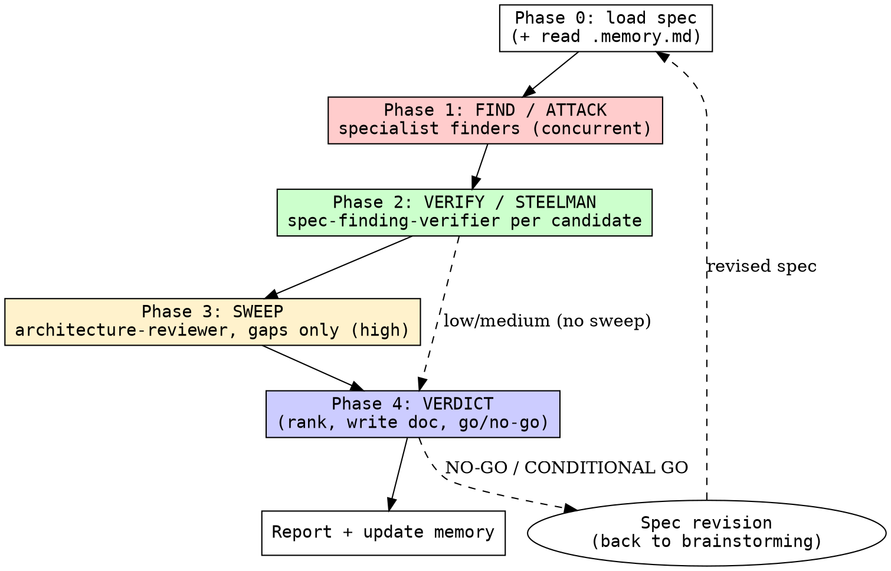

# reviewing-specs

## Overview

Multi-angle steel-man spec review, powered by **specialist subagents** that each get their own context window and a scoped read-only toolset: fan out the finders to attack the spec from every dimension, adversarially verify each candidate (steelman that it is real, or refute it from the spec), sweep for gaps, then deliver a ranked verdict with concrete rewrites. **A bad spec propagates to bad plans, bad code, and bad teaching — this is the upstream gate.**

Findings span six dimensions: **product requirements, architecture, edge cases, scope/YAGNI, security/privacy, testability**.

## Agents

Dispatch these by `subagent_type`. Definitions live in [`agents/`](agents/) (install them so your agent registers them — see the repo README).

| Agent | Role | Dimension |
|-------|------|-----------|
| [`product-requirements-reviewer`](agents/product-requirements-reviewer.md) | finder | user stories, acceptance criteria, success metrics, stakeholders |
| [`architecture-reviewer`](agents/architecture-reviewer.md) | finder | components, boundaries, rollback/failure, coupling, contracts |
| [`edge-case-reviewer`](agents/edge-case-reviewer.md) | finder | boundaries, failure modes, concurrency, partial failure, idempotency |
| [`scope-yagni-reviewer`](agents/scope-yagni-reviewer.md) | finder | scope creep, gold-plating, premature optimization, unasked problems |
| [`security-privacy-reviewer`](agents/security-privacy-reviewer.md) | finder | authn/authz, data handling, PII/compliance, trust boundaries, secrets |
| [`testability-reviewer`](agents/testability-reviewer.md) | finder | test strategy, observability, measurable success, debuggability |
| [`spec-finding-verifier`](agents/spec-finding-verifier.md) | verifier | 3-state CONFIRMED / PLAUSIBLE / REFUTED |

If a host can't register named agents, fall back to dispatching generic subagents with each agent file's body as the prompt.

<HARD-GATE>
NEVER approve a spec without completing Find → Verify → Verdict for the chosen effort. NEVER ship a CRITICAL finding without verifying it against the actual spec text. NEVER modify the spec file — write only the review to `docs/raki/reviews/`. Every finding must quote verbatim spec text and carry a concrete fix. Do NOT refute a candidate for being "speculative" when the gap is real but unstated in the spec — an unaddressed concern is the finding.
</HARD-GATE>

## Effort dial

Scale which agents run to the spec's stakes (default **medium**):

| Effort | Finder agents | Candidates/agent | Verify | Sweep | Cap | Use when |
|--------|---------------|------------------|--------|-------|-----|----------|
| low    | `product-requirements-reviewer`, `architecture-reviewer` | 4 | no | no | ≤4 | Quick sanity check, small/low-risk change, "quick review" |
| medium | + `edge-case-reviewer`, `scope-yagni-reviewer` | 4 | `spec-finding-verifier`, 1-vote | no | ≤12 | Standard feature spec, normal risk (default) |
| high   | all 6 finders | 4 | `spec-finding-verifier`, 1-vote | yes | ≤20 | Auth/data/public-API/infra, new architecture, "deep review" |

Default to `medium`. Escalate to `high` automatically when the spec touches authentication, data models, public APIs, infrastructure, or money.

## Checklist

1. **Phase 0 — Load spec** — read the spec in full. Note goals, constraints, scope (in/out), success criteria, stakeholders, dependencies. Read `.memory.md` for accumulated lessons and project quirks. If success criteria / scope / rollback are missing, record them as pre-existing findings before dispatching.
2. **Phase 1 — Find (ATTACK)** — dispatch the finder agents for the chosen effort via the Agent tool **in a single message** so they run concurrently. Pass each the spec and its candidate cap N. Each returns up to N candidates in `{section, quote, issue, severity, fix}` shape, citing verbatim spec text. Do NOT let one agent suppress another.
3. **Phase 2 — Verify (STEELMAN)** — dedup candidates citing the same text/concern. Dispatch `spec-finding-verifier` once per remaining candidate (concurrently): it returns **CONFIRMED / PLAUSIBLE / REFUTED**. Keep CONFIRMED + PLAUSIBLE; drop REFUTED. All CRITICAL findings MUST be verified.
4. **Phase 3 — Sweep** (high effort) — dispatch one fresh `architecture-reviewer` given the verified list, hunting ONLY for holistic gaps the focused passes missed. Verify any new findings. Empty sweep is fine.
5. **Phase 4 — Verdict** — rank by severity (CRITICAL → MAJOR → MINOR → NIT) to the cap. Resolve `<date>` with `date +%F` and write the review to `docs/raki/reviews/<date>-<topic>-spec-review.md`. Deliver **GO / CONDITIONAL GO / NO-GO**.
6. **Report** — summarize the verdict and top 3 findings to the user. Do not bury a NO-GO in prose. Append any durable lesson to `.memory.md`.

## Process Flow



## Key Principles

- **Attack first, steelman second.** Every finder starts adversarial — hunt flaws, gaps, contradictions. The verifier then steel-mans each finding to kill false positives.
- **Quote verbatim.** Every finding includes the exact spec text it references (or `''` + the section name for an omission). No paraphrasing.
- **Concrete rewrites, not vague complaints.** Instead of "this is unclear," give the specific text or decision that would fix it.
- **Severity is not optional.** Every finding is CRITICAL / MAJOR / MINOR / NIT. The verdict is derived from the count and distribution, never from intuition.
- **Verification beats volume.** 12 verified findings beat 30 unverified ones — the verifier eliminates noise.
- **Domain expertise matters.** A security finding from `security-privacy-reviewer` outranks a generalist noticing "something seems off about auth."
- **Watch for spec-to-spec drift.** If prior specs exist for the same system, cross-reference for contradictions.

## Red Flags

These are automatic CRITICAL findings — no need to debate severity:

| Flag | Meaning |
|------|---------|
| No success criteria | Cannot validate completion; endless scope creep |
| Contradicts itself | Unimplementable; two sections disagree |
| No rollback / failure plan | Production incidents with no escape hatch |
| Scope undefined or unbounded | Yak-shaving; never ships |
| Missing authn/authz model | Security incident waiting to happen |
| No data retention/privacy story for PII | Compliance violation (GDPR/CCPA) |
| Breaks existing contract/API without migration | Customer-facing breakage |
| Too vague to plan from | Cannot write implementation steps |
| Missing boundary conditions | Bugs in edge cases ("process all files", no max size) |
| Test strategy absent or unverifiable | Quality cannot be assured |

## Safety

Read-only over the spec and codebase; the only write is the review under `docs/raki/reviews/`. Finder/verifier agents declare `tools: Read, Grep, Glob` and cannot edit. Never modify the spec under review, and never touch `CLAUDE.md`, `AGENTS.md`, or other tools' memory files. Fail closed: when unsure, flag — the verifier downgrades.

## Memory

[`.memory.md`](.memory.md) holds project-specific lessons (known false positives, conventions, recurring spec gaps) — read it in Phase 0, append durable lessons in Phase 6, so the skill stops re-learning the same quirks.

## Integration

```
brainstorming (produces spec) -> reviewing-specs (destroys/validates spec) -> writing-plans (creates impl plan)
                                          |
                                          NO-GO / CONDITIONAL GO -> back to brainstorming for revision
```

- **First review skill**, alongside `reviewing-plans` (validates the plan) and `reviewing-code` (validates the code).
- **Used AFTER** `brainstorming` produces a spec, **BEFORE** `writing-plans` begins.
- **Output destination:** `docs/raki/reviews/<date>-<topic>-spec-review.md`. Only a **GO** proceeds to planning; **NO-GO / CONDITIONAL GO** feeds back into `brainstorming` or spec revision. The specialist agent definitions live in [`agents/`](agents/).
