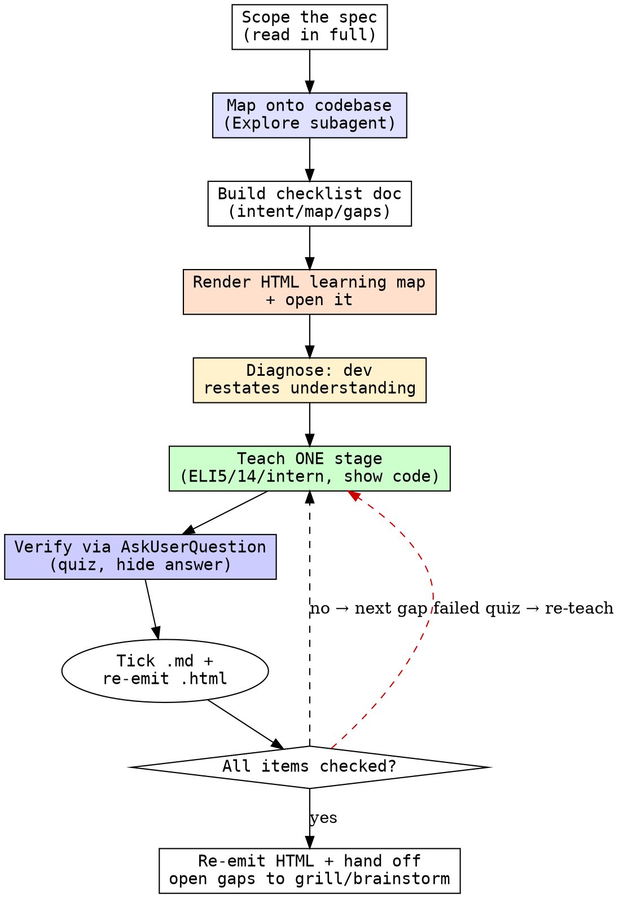

# spec-walkthrough

## Overview

A wise, effective teaching loop for a spec. The goal is that the developer **deeply understands** the spec before writing code — high level (intent, why it exists) and low level (requirements, how it lands in the existing code, the edge cases). Read the spec AND the codebase it touches, then teach incrementally, one stage at a time, confirming mastery of each stage before moving on. Never dump everything at the end.

Two artifacts back the session: a markdown checklist (the source of truth for the gate) and a self-contained **HTML learning map** — a visual companion showing the spec mapped onto the code (requirements, spec → code, open gaps) alongside live mastery progress.

<HARD-GATE>
The session does NOT end until the developer has demonstrated mastery of every item on the checklist. "Demonstrated" means they restated it correctly or answered a quiz correctly — not that you explained it and they said "got it." Do not advance to the next stage until the current stage is mastered. Do not declare the session complete with unchecked items.
</HARD-GATE>

## What they must understand

Build the checklist around these three pillars:

1. **Intent** — what the spec asks for and why; its requirements, constraints, and acceptance criteria.
2. **Codebase map** — how the spec lands in the existing code: where it'll be implemented, which modules/seams it touches, what existing behavior it changes or depends on.
3. **Gaps** — the ambiguities, open decisions, and edge cases that must be resolved before (or while) building. The learner must understand *that these exist and why they matter* — not necessarily resolve them here.

For every item, drive at **why** (then drill into deeper whys), plus **what** and **how**. Understanding the intent deeply is imperative — do not let it jump to implementation before the intent lands.

## Checklist

1. **Scope the spec** — read the spec/PRD/ticket in full. Note its stated goals, requirements, constraints, and success criteria.
2. **Map onto the codebase** — use the Agent tool with `subagent_type=Explore` to walk the code the spec touches: where the work lands, which modules/seams are involved, what existing behavior is affected. This pass produces the Codebase-map pillar and surfaces candidate gaps.
3. **Build the checklist** — resolve today's date (`date +%F`) and write the doc at `docs/raki/learning/<date>-<topic>-spec.md` with an unchecked item per concept across the three pillars. This is the source of truth for the gate.
4. **Render the learning map** — write the self-contained HTML companion to `docs/raki/learning/<date>-<topic>-spec.html` (Tailwind + Mermaid via CDN, no build step). Visualize the three pillars and embed the mastery checklist. Open it (`open <path>` on macOS, `xdg-open` on Linux, `start` on Windows) and tell the developer the absolute path. See [HTML-REPORT.md](HTML-REPORT.md).
5. **Diagnose first** — before teaching anything, ask the developer (in plain chat) to restate their current understanding of the spec. Find the gaps from there. Don't re-explain what they already know.
6. **Teach one stage** — explain the smallest next gap. Adapt depth on request: ELI5, ELI14, or ELI-intern. Show the real code the spec touches, or use the debugger, when it makes the concept concrete.
7. **Verify the stage** — quiz them. For multiple-choice, use `AskUserQuestion`; for open-ended "explain why…" questions, ask in plain chat. Vary the position of the correct answer. Do NOT reveal the answer until after they respond. Tick the checklist item only on a correct answer.
8. **Loop** — repeat steps 6–7 per stage until every checklist item is checked. On each mastery, update BOTH the `.md` and re-emit the `.html` so its progress reflects reality (regenerate-on-tick; the HTML is static — you rewrite the file).
9. **Close** — only when the gate is satisfied. Re-emit the HTML with all items checked. Summarize what was mastered and hand off the open gaps to `grill-me` or `brainstorming` for resolution before implementation.

## Process Flow

## Quizzing rules

- **Multiple-choice** → `AskUserQuestion`. **Open-ended** ("explain why…", "restate this") → ask directly in chat; `AskUserQuestion` forces a choice and can't capture free reasoning.
- **Randomize** which option is correct; never let the answer sit in the same slot.
- **Never reveal the answer before they respond.** Explain only after they answer.
- A wrong answer is signal, not failure — re-teach that gap a different way, then re-quiz. Do not check the item until correct.
- Prefer "why" questions over "what" recall — mastery is reasoning, not memorization. For a spec, favor "where would this land in the code" and "what breaks if requirement X is misread."

## Key Principles

- **Read the code, not just the spec.** A spec is only half the picture; mastery means knowing where it lands. Always do the codebase-mapping pass.
- **Diagnose before teaching.** Always have them restate first. Teaching into a gap you haven't located wastes both of you.
- **Incremental, never a final brain-dump.** One stage, one gate, then the next.
- **Mastery is demonstrated, not asserted.** "Makes sense" is not mastery. A correct restatement or quiz answer is.
- **Drill the whys.** Each why has a why under it — go down until it bottoms out in a real requirement or constraint.
- **Make it concrete.** Show the actual code the spec touches, run the debugger, point at the modules. Abstract spec-reading doesn't stick.
- **Surface gaps, don't silently fill them.** The learner must see the ambiguities and open decisions — hand them off, don't paper over them.
- **The gate is real.** Do not end early to be polite.

## Red Flags

| Flag | Meaning |
|------|---------|
| Teaching the spec without reading the code | Half the picture; the Codebase-map pillar is empty |
| Explaining everything before any quiz | Violates incremental teaching; nothing is verified |
| "Does that make sense?" as the check | Self-reported understanding ≠ mastery; quiz instead |
| Revealing the answer with the question | Destroys the verification signal |
| Same answer slot every quiz | Learner pattern-matches position, not concept |
| Advancing with unchecked items | Breaks the HARD-GATE |
| Quietly resolving an ambiguity | Gaps must be surfaced and handed off, not hidden |
| Teaching how-to-implement before intent lands | They'll build the wrong thing confidently |
| HTML drifts from the .md checklist | The two artifacts must agree; re-emit on every tick |
| Adding JS state/interactivity to the HTML | It's regenerate-on-tick and static; only scripts are the Tailwind + Mermaid CDNs |

## Integration

- **Sibling of `teach-me`** — same loop, but `teach-me` teaches a *completed* change after the fact, while `spec-walkthrough` teaches a spec *before* implementation, mapped onto the code it will touch.
- **Complements `reviewing-specs`** — `reviewing-specs` attacks and validates a spec (go/no-go); `spec-walkthrough` transfers understanding of it to the developer. Run the review to decide *whether* to build; run the walkthrough to make sure *whoever builds it* understands it.
- **Used BEFORE** `writing-plans` / implementation. Hands surfaced gaps off to `grill-me` or `brainstorming` for resolution.
- **Output destination:** the checklist persists at `docs/raki/learning/<date>-<topic>-spec.md` and its visual companion at `docs/raki/learning/<date>-<topic>-spec.html` — a durable, resumable record. The HTML scaffold and diagram patterns live in [HTML-REPORT.md](HTML-REPORT.md).
