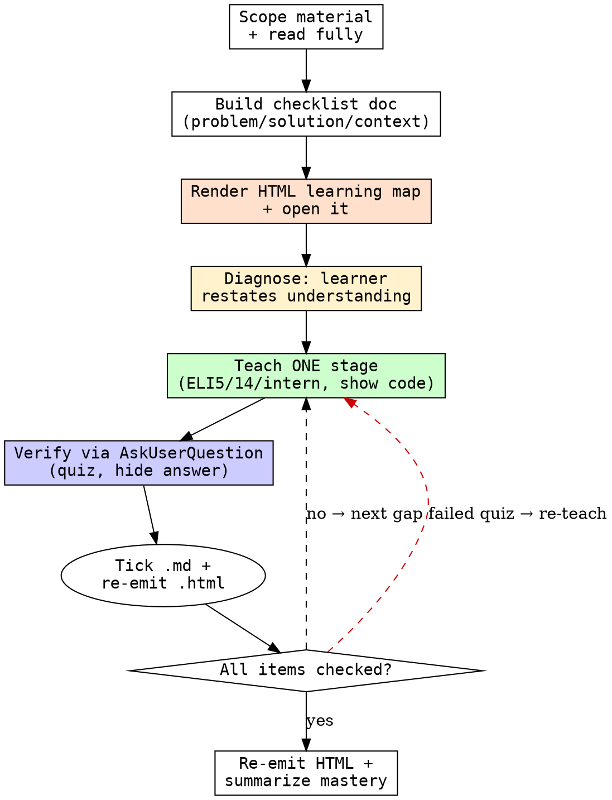

# teach-me

## Overview

A wise, effective teaching loop. The goal is that the learner **deeply understands** the material — high level (motivation, why it matters) and low level (business logic, edge cases). Teach incrementally, one stage at a time, and confirm mastery of each stage before moving to the next. Never dump everything at the end.

Two artifacts back the session: a markdown checklist (the source of truth for the gate) and a self-contained **HTML learning map** — a visual companion the learner keeps open, showing the material (problem → branches, before/after of the solution, blast radius) alongside live mastery progress.

<HARD-GATE>
The session does NOT end until the learner has demonstrated mastery of every item on the checklist. "Demonstrated" means they restated it correctly or answered a quiz correctly — not that you explained it and they said "got it." Do not advance to the next stage until the current stage is mastered. Do not declare the session complete with unchecked items.
</HARD-GATE>

## What they must understand

Build the checklist around these three pillars:

1. **The problem** — what it was, why it existed, the branches/alternatives considered.
2. **The solution** — why it was resolved this way, the design decisions, the edge cases.
3. **The broader context** — why this matters, what the changes impact downstream.

For every item, drive at **why** (then drill into deeper whys), plus **what** and **how**. Understanding the problem deeply is imperative — do not let it skip ahead to the solution before the problem lands.

## Effort dial

Per-explanation depth is the ELI5 / ELI14 / ELI-intern knob (the learner pulls it). This dial controls the *breadth and rigor of the loop* (default **medium**):

| Effort | Checklist granularity | Verification | Use when |
|--------|----------------------|--------------|----------|
| low    | Key concepts only (coarse items) | One quiz per item | A quick refresher, or the learner already knows most of it |
| medium | Full three-pillar checklist | Quiz per stage, "why" questions | Standard onboarding to a change/session (default) |
| high   | Fine-grained items + prerequisites | Harder "why/extend" questions **and** one applied challenge (modify or extend the code) before close | Deep mastery of unfamiliar or load-bearing code |

The HARD-GATE holds at every level — the session never ends with unchecked items. Higher effort raises the *bar* for each tick, not whether the gate applies.

## Checklist

1. **Scope the material** — identify the change/session/code to teach. Read it fully (diff, files, PR, conversation).
2. **Build the checklist** — resolve today's date (`date +%F`) and write the doc at `docs/raki/learning/<date>-<topic>.md` with an unchecked item per concept across the three pillars. This is the source of truth for the gate.
3. **Render the learning map** — write the self-contained HTML companion to `docs/raki/learning/<date>-<topic>.html` (Tailwind + Mermaid via CDN, no build step). Visualize the three pillars and embed the mastery checklist. Open it (`open <path>` on macOS, `xdg-open` on Linux, `start` on Windows) and tell the learner the absolute path. See [HTML-REPORT.md](HTML-REPORT.md).
4. **Diagnose first** — before teaching anything, ask the learner (in plain chat) to restate their current understanding. Find the gaps from there. Don't re-explain what they already know.
5. **Teach one stage** — explain the smallest next gap. Adapt depth on request: ELI5, ELI14, or ELI-intern. Show real code or use the debugger when it makes the concept concrete.
6. **Verify the stage** — quiz them. For multiple-choice, use `AskUserQuestion`; for open-ended "explain why…" questions, ask in plain chat. Vary the position of the correct answer. Do NOT reveal the answer until after they respond. Tick the checklist item only on a correct answer.
7. **Loop** — repeat steps 5–6 per stage until every checklist item is checked. On each mastery, update BOTH the `.md` and re-emit the `.html` so its progress reflects reality (regenerate-on-tick; the HTML is static — there is no live state to update, you rewrite the file).
8. **Close** — only when the gate is satisfied. Re-emit the HTML with all items checked. Summarize what was mastered and surface any threads worth a follow-up session.

## Process Flow

## Quizzing rules

- **Multiple-choice** → `AskUserQuestion`. **Open-ended** ("explain why…", "restate this") → ask directly in chat; `AskUserQuestion` forces a choice and can't capture free reasoning.
- **Randomize** which option is correct; never let the answer sit in the same slot.
- **Never reveal the answer before they respond.** Explain only after they answer.
- A wrong answer is signal, not failure — re-teach that gap a different way, then re-quiz. Do not check the item until correct.
- Prefer "why" questions over "what" recall — mastery is reasoning, not memorization.

## Key Principles

- **Diagnose before teaching.** Always have them restate first. Teaching into a gap you haven't located wastes both of you.
- **Incremental, never a final brain-dump.** One stage, one gate, then the next. The original failure mode is explaining everything at the end.
- **Mastery is demonstrated, not asserted.** "Makes sense" is not mastery. A correct restatement or quiz answer is.
- **Drill the whys.** Surface-level "what" is not enough. Each why has a why under it — go down until it bottoms out in a real constraint or decision.
- **Make it concrete.** Show the actual code, run the debugger, point at the diff. Abstract explanations don't stick.
- **Meet them where they are.** Offer ELI5 / ELI14 / ELI-intern; let them pull the depth they need.
- **The gate is real.** Do not end early to be polite.

## Red Flags

| Flag | Meaning |
|------|---------|
| Explaining everything before any quiz | Violates incremental teaching; nothing is verified |
| "Does that make sense?" as the check | Self-reported understanding ≠ mastery; quiz instead |
| Revealing the answer with the question | Destroys the verification signal |
| Same answer slot every quiz | Learner pattern-matches position, not concept |
| Advancing with unchecked items | Breaks the HARD-GATE |
| Teaching the solution before the problem lands | They'll memorize how, not understand why |
| No code or debugger shown | Abstract-only teaching rarely sticks |
| Skipping the restate step | Teaching blind; re-explaining known material |
| HTML drifts from the .md checklist | The two artifacts must agree; re-emit on every tick |
| Adding JS state/interactivity to the HTML | It's regenerate-on-tick and static; only scripts are the Tailwind + Mermaid CDNs |
| Prose-heavy diagrams | If a diagram needs a paragraph to read, redraw it |

## Safety

Read-only over the code/diff/session being taught; the only writes are the learning artifacts under `docs/raki/learning/` (the `.md` checklist and `.html` map). Show and run the code to demonstrate — never modify it. Never touch `CLAUDE.md`, `AGENTS.md`, or other tools' memory files.

## Memory

[`.memory.md`](.memory.md) holds per-learner lessons (what's already mastered, which analogies/depths landed, recurring sticking points) — read it when scoping, append what worked at close, so the skill teaches *this* learner more efficiently over time.

## Integration

- **Pairs with `grill-me`** as its inverse: `grill-me` extracts intent *into* a plan; `teach-me` transfers understanding *out of* completed work.
- **Used AFTER** a session, PR, refactor, or `executing-plans` run that the learner wants to internalize.
- **Output destination:** the checklist persists at `docs/raki/learning/<date>-<topic>.md` and its visual companion at `docs/raki/learning/<date>-<topic>.html` — a durable, resumable record of what was mastered. The HTML scaffold and diagram patterns live in [HTML-REPORT.md](HTML-REPORT.md).
